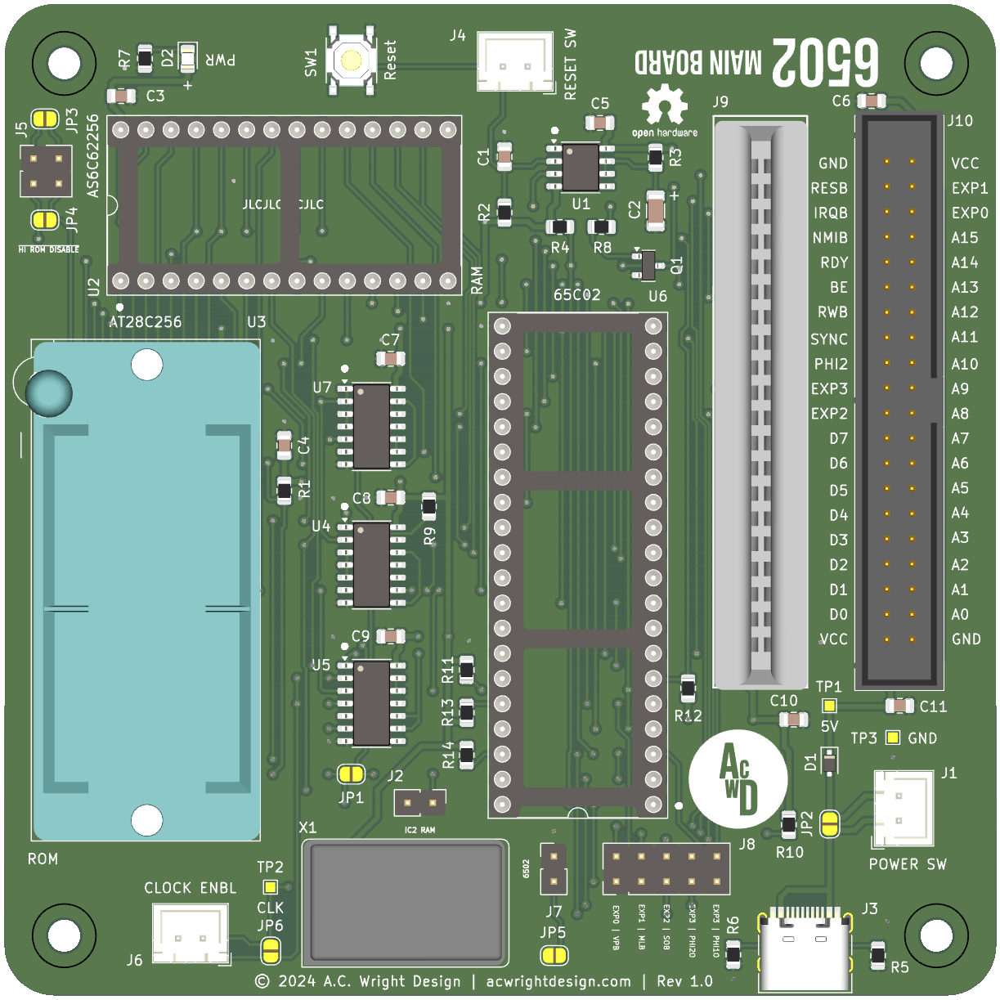

6502 Project
=============

**A 6502 Based 8-Bit Retro Computer Project**

## Overview

The project aims to create a retro-style 8-bit computer based on the 65(c)02 microprocessor. It includes custom-designed main board, development board, 
backplane boards, various peripheral cards, various helper boards, and a simple operating system.

The project is designed using KiCad for PCB design and is open-source, allowing enthusiasts to contribute and modify the designs. The boards are manufactured 
by JLCPCB and use a combination of surface-mount and through-hole components.

## Hardware

The [Hardware](./Hardware) folder contains several custom-designed PCBs. These are divided into the following categories:

- **Boards**: The main board, development board, backplane boards and other peripheral boards.
- **Cards**: Various peripheral cards for plugging into the backplane or main board card slot(s).
- **Helpers**: Additional boards that provide specific functionalities or interfaces.

**Boards**:

- **Backplane Board**: A backplane board that provides multiple card slots for peripheral cards and connects to the main board via a ribbon cable.
- **Backplane Board Pro**: An enhanced version of the backplane board with additional features.
- **Dev Board**: The development board is an alternative to the main board which acts as a 65(c)02 emulator using a Teensy 4.1 with [vrEmu6502](https://github.com/visrealm/vrEmu6502).
- **Dev Output Board**: A compliment to the Dev Board that provides [VT-AC](https://github.com/acwright/VT-AC) ASCII terminal display output using a Waveshare 2.4in LCD. **UNTESTED**
- **Input Board**: A board that provides PS/2 keyboard and mouse interfaces along with SNES controller support.
- **LCD Board**: A board that provides a 320x240 LCD display. **UNTESTED**
- **Main Board**: The main board that contains the 65(c)02 CPU, memory, memory decoding ICs, one peripheral card slot, and a bus connector.
- **Output Board**: A board that provides VGA output using the Pico9918 and sound output using the ARMSID. **UNTESTED**

**Cards**:

- **Blinkenlights Card**: A card that provides a set of LEDs for visual output. 
- **CPU Card**: A card that can host a 65(c)02 CPU and associated components. 
- **CPU Card Pro**: A card that can host a 65816 CPU and associated components. **UNTESTED**
- **GPIO Card**: A card that provides general-purpose input/output (GPIO) pins for interfacing with external devices.
- **LCD Card**: A card that provides output to a 16x2 LCD display.
- **Memory Card**: A card that provides RAM or ROM memory. 
- **Prototype Card**: A card that provides a prototyping area for custom circuits. 
- **RAM Card**: A card that provides 512k of extra RAM. 
- **RTC Card**: A card that provides real-time clock functionality. 
- **Serial Card**: A card that provides serial communication capabilities. 
- **Serial Card Pro**: An enhanced version of the Serial Card with additional features. 
- **Sound Card**: A card that provides audio output capabilities using the ARMSID.
- **Storage Card**: A card that provides storage capabilities using a CompactFlash card.
- **Storage Card Pro**: A card that provides storage capabilities with an SD Card, 16MB Flash and SPI. **UNTESTED**
- **VGA Card**: A card that provides VGA output capabilities using the [Pico9918](https://github.com/visrealm/pico9918).
- **VGA Card Pro**: A custom programmable VGA Card using the Pi Pico. **UNTESTED**
- **Video Card**: A card that provides composite video output capabilities using the TMS9918A.
- **Video Card Pro**: A card that provides composite video output capabilities using the Atmega1284p. **UNTESTED**

**Helpers**:

- **Backplane Helper**: A backplane board that adds two additional slots for cards.
- **Breadboard Helper**: A board that allows easy connection to a breadboard for prototyping.
- **Clock Helper**: A board that allows for running and stopping the clock along with single cycle or instruction stepping.
- **DB25 Helper**: A board that allows easy connection of GPIO ports to a DB25 connector.
- **GPIO Helper**: A board that provides eight buttons and eight LEDs for user input and output.
- **GPIO Breadboard Helper**: A board that allows easy connection of GPIO ports to a breadboard for prototyping.
- **Joystick Helper**: A board that provides an Atari 2600 style joystick interface for user input.
- **Keyboard Helper**: A board that provides a 64 key matrix keyboard interface and dual joystick ports for user input.
- **Keyboard Encoder Helper**: A board that translates keyboard scan data and PS/2 keyboard data to ASCII.
- **Keypad Helper**: A board that provides a 4x4 and 2x4 matrix keypad for user input. **UNTESTED**
- **Keypad LCD Helper**: A board that contains an LCD display and is designed to work with the Keypad Helper. **UNTESTED**
- **Mega Helper**: A board that interfaces the Arduino Mega 2560 R3 with 6502 bus. **UNTESTED**
- **PS2 Helper**: A board that allows connection of a PS/2 keyboard.

**Carts**:

- **ROM Cart**: A cartridge that provides a ROM image for the system.

## Schematics

The [Schematics](./Schematics) folder contains the schematic diagrams for all the PCBs in the project. These schematics are created using KiCad and provide detailed information about the components and connections used in each board. See the README file in the Schematics folder for more details.

## Firmware

The [Firmware](./Firmware) folder contains the source code for the firmware running on the various microcontrollers used in the project, such as the Teensy 4.1. The firmware is written in C/C++ and is designed to interface with the 65(c)02 and other hardware components. See the README file in the Firmware folder for more details.

## Software

The [Software](./Software) folder contains various example projects written in assembly language for the 65(c)02. These examples demonstrate how to interface with the various hardware components and peripherals. See the README file in the Software folder for more details.

## Production

The [Production](./Production) folder contains the JLCPCB ready production files for the various PCBs, including Gerber files, BOMs, and assembly instructions. See the README file in the Production folder for more details.

## Documentation

The documentation for this project can be found at: [https://6502.acwrightdesign.com](https://6502.acwrightdesign.com)

See the README file in the Documentation folder for more details.

## Licensing

Hardware for this project is licensed under the CERN Open Hardware Licence Version 2 - Permissive License. See the [LICENSE](./LICENSE) file for more details.
Software for this project is licensed under the MIT License. See the [LICENSE](./Software/LICENSE) file for more details.
Firmware for this project is licensed under the MIT License. See the [LICENSE](./Firmware/LICENSE) file for more details.